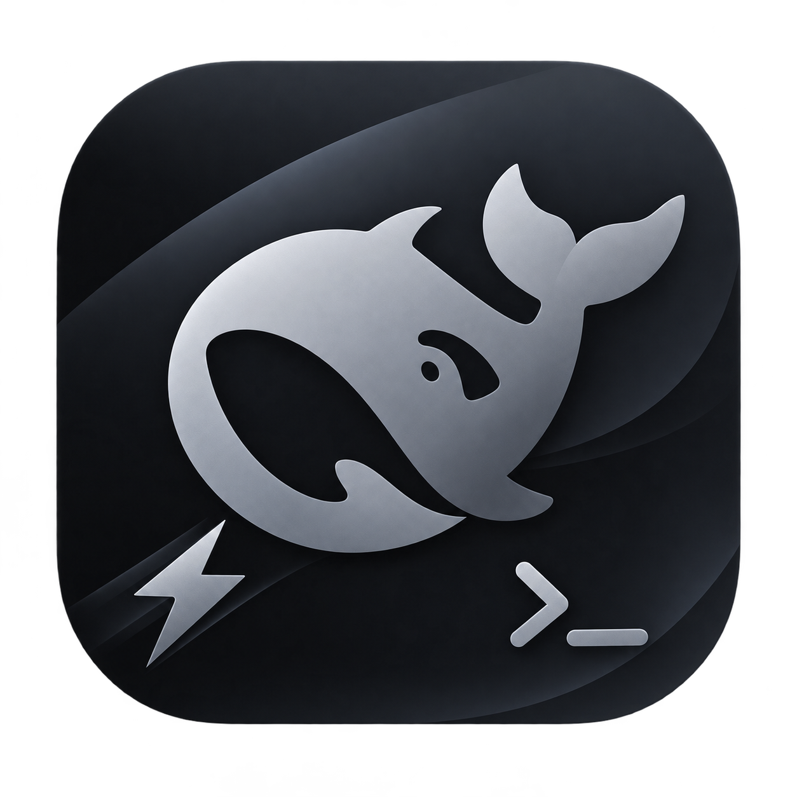
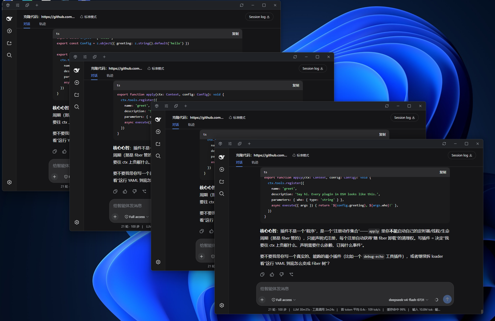
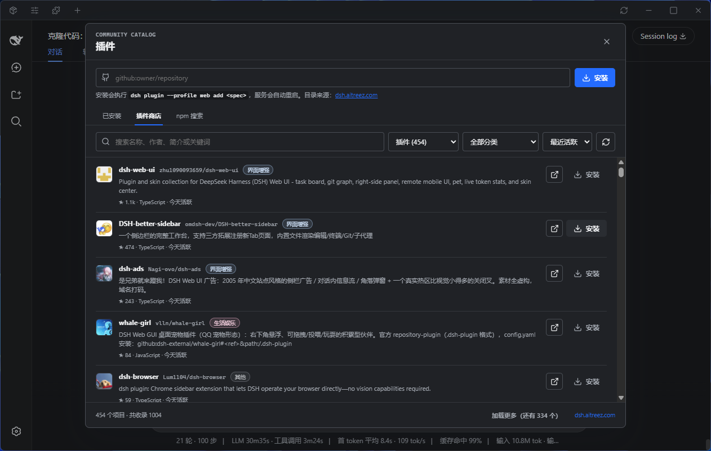
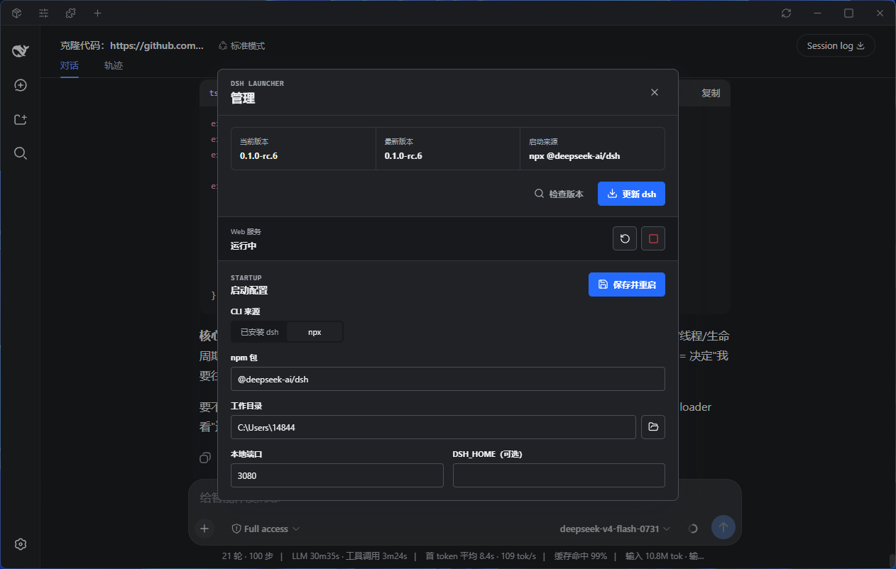

<p align="center">
  
</p>

# DSH Launcher

一个基于 Tauri 2 的 DeepSeek Harness 桌面启动器。它负责启动和停止 `dsh web`，主窗口只承载 dsh WebUI；包管理、配置文件编辑、插件安装和新窗口入口都收纳在窄工具栏的弹窗里。

插件目录使用 [DSH 插件商店](https://dsh.aitreez.com/) 的公开页面，仅在用户打开插件弹窗时加载一次；安装通过 dsh 官方命令完成，例如 `dsh plugin --profile web add github:omdsh-dev/DSH-better-sidebar`。

## 界面截图

<p align="center">
  
  
  
</p>

## 插件推荐与使用建议

以下插件均属于功能与体验增强，不会干扰 DSH 的 loop 工作流，个人推荐按需安装，如果你很需要如playwrite（浏览器控制）等高级功能，我推荐等待或着手开发一个通用MCP插件，而非安装很多个不同的tools插件（除非没有支持的mcp）：

### [DSH Better Sidebar](https://github.com/omdsh-dev/DSH-better-sidebar)

提供更完善的侧边栏与系统终端，让 dsh WebUI 从基础对话界面进一步升级为更专业、更高效的 Agent IDE。

```powershell
dsh plugin --profile web add dsh-better-sidebar
```

### [dsh-at-file](https://github.com/omdsh-dev/dsh-at-file)

支持在对话框中快捷添加文件路径，减少手动输入与来回查找，让文件引用更加顺手自然。

```powershell
dsh plugin --profile web add "github:omdsh-dev/dsh-at-file"
```

### [dsh-tool-diff](https://github.com/omdsh-dev/dsh-tool-diff)

diff工具是一个值得从 Bash 中“毕业”的文件审查工具，帮助 Agent 更高效地查看与审阅文件变更，在提升审查体验的同时大幅节省 token。


## 开发
```powershell
dsh plugin --profile web add github:omdsh-dev/dsh-tool-diff
```

```powershell
npm install
npm run tauri dev
```

启动器默认使用 PATH 中的 `dsh`：

```powershell
npm install -g @deepseek-ai/dsh
```

也可以在启动设置中切换为 npx 模式。首次通过 npx 启动需要网络连接。

## 构建

```powershell
npm run tauri build
```

配置保存在 Tauri 的应用配置目录中。退出应用时，启动器会终止由它创建的 dsh 进程树。


## 相关链接

- [DSH 插件商店](https://dsh.aitreez.com/)
- [Linux.do](https://linux.do)
